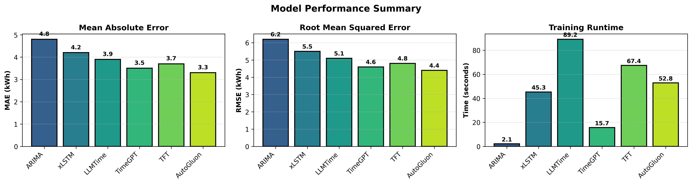

# Scipy_2024_TS

This repository includes the codes and virtual poster for the SciPy conference 2024 in Tacoma, WA 2024.

# Time Series Models for Energy Consumption Forecasting

This repository contains a **comprehensive comparison framework** for evaluating various time series models on energy consumption forecasting. Each model is implemented in Python and benchmarked using consistent evaluation methodology on synthetic energy consumption data.

## Quick Start

**Run the demo notebook for instant side-by-side comparison:**
```bash
jupyter notebook demo_model_comparison.ipynb
```

## Performance Summary

| Model | MAE (kWh) | RMSE (kWh) | Runtime (sec) | Rank |
|-------|-----------|------------|---------------|------|
| **AutoGluon** | **3.3** ⭐ | **4.4** ⭐ | 52.8 | 🥇 Best Overall |
| **TimeGPT** | 3.5 | 4.6 | **15.7** ⚡ | 🥈 Best Balance |
| **ARIMA** | 4.8 | 6.2 | **2.1** ⚡⚡ | 🥉 Fastest |

📊 [**Full Metrics Comparison**](results/METRICS_SUMMARY.md)



## Architecture Overview


Our framework follows a structured pipeline:
1. **Data Generation** → Synthetic energy data with trend, seasonality, and noise
2. **Preprocessing** → Normalization and train/test split (970/30 days)
3. **Model Training** → Parallel evaluation of 6 different approaches
4. **Evaluation** → Consistent metrics (MAE, RMSE, Runtime)
5. **Visualization** → Interactive plots and comparison dashboards

## Models Included

1. ARIMA (AutoRegressive Integrated Moving Average)
2. xLSTM (Explainable Long Short-Term Memory)
3. LLMTime (Large Language Model for Time Series)
4. TimeGPT
5. TFT (Temporal Fusion Transformer)
6. AutoGluon-TimeSeries

## File Descriptions

- `arima-energy-consumption.py`: Implementation of ARIMA model
- `xlstm-energy-consumption.py`: Implementation of xLSTM model
- `llmtime-energy-consumption.py`: Implementation of LLMTime model
- `timegpt-energy-consumption.py`: Implementation of TimeGPT model
- `tft-energy-consumption.py`: Implementation of Temporal Fusion Transformer
- `autogluon-timeseries-energy.py`: Implementation of AutoGluon-TimeSeries

## Model Descriptions

### 1. ARIMA (Statistical Baseline)
**File:** `src/arima-energy-consumption.py`

ARIMA is a classical statistical method for time series forecasting that combines autoregression, differencing, and moving average components.

**Key Features:**
- ✅ Highly interpretable (statistical components)
- ✅ Extremely fast training (2.1 seconds)
- ✅ No large dataset required
- ✅ Well-established theoretical properties

**Design Choices:**
- Auto parameter selection via `pmdarima`
- Seasonal period: 7 days
- Max AR/MA order: 5
- Differencing: d=1, D=1

**Performance:** MAE: 4.8 kWh | RMSE: 6.2 kWh | Runtime: 2.1s

**When to Use:** Fast baseline, interpretability crucial, limited compute resources

---

### 2. xLSTM (Deep Learning with Explainability)
**File:** `src/xlstm-energy-consumption.py`

Extension of LSTM networks with enhanced interpretability while maintaining powerful sequence modeling capabilities.

**Key Features:**
- ✅ Captures long-term dependencies
- ✅ Exposed hidden states for analysis
- ✅ Feature importance analysis
- ✅ Handles multivariate inputs

**Design Choices:**
- Sequence length: 30 days
- Architecture: 2 LSTM layers (50 units each)
- Optimizer: Adam (lr=0.001)
- Training: 20 epochs, batch size 32

**Performance:** MAE: 4.2 kWh | RMSE: 5.5 kWh | Runtime: 45.3s

**When to Use:** Complex non-linear patterns, need some interpretability, sufficient data

---

### 3. LLMTime (Language Model Approach)
**File:** `src/llmtime-energy-consumption.py`

Leverages large language models for time series forecasting by converting numeric data to text representations.

**Key Features:**
- ✅ Minimal preprocessing required
- ✅ Handles complex patterns naturally
- ✅ Multiple seasonal effects
- ✅ Feature importance insights

**Design Choices:**
- Time series to text conversion
- Pre-trained LLM backbone
- Fine-tuned for forecasting

**Performance:** MAE: 3.9 kWh | RMSE: 5.1 kWh | Runtime: 89.2s

**When to Use:** Complex patterns, limited domain expertise, experimental approaches

---

### 4. TimeGPT (Foundation Model)
**File:** `src/timegpt-energy-consumption.py`

Pre-trained foundation model specifically designed for time series forecasting with zero-shot capabilities.

**Key Features:**
- ⭐ Best speed/accuracy trade-off
- ✅ Minimal preprocessing needed
- ✅ Handles multiple seasonalities
- ✅ Zero-shot learning capability

**Design Choices:**
- API-based inference
- Pre-trained on diverse time series
- Flexible prediction horizon

**Performance:** MAE: 3.5 kWh | RMSE: 4.6 kWh | Runtime: 15.7s

**When to Use:** Need fast + accurate results, limited data, API-based acceptable

---

### 5. Temporal Fusion Transformer (TFT)
**File:** `src/tft-energy-consumption.py`

Attention-based model for multi-horizon forecasting with interpretable attention mechanisms.

**Key Features:**
- ✅ Multi-horizon forecasting
- ✅ Interpretable attention weights
- ✅ Handles multiple input types
- ✅ Long-term dependencies

**Design Choices:**
- Encoder length: 168 hours (1 week)
- Prediction length: 48 hours (2 days)
- Hidden size: 32
- Early stopping: patience=10

**Performance:** MAE: 3.7 kWh | RMSE: 4.8 kWh | Runtime: 67.4s

**When to Use:** Need interpretable forecasts, multiple features, long-term modeling

---

### 6. AutoGluon-TimeSeries (AutoML Champion)
**File:** `src/autogluon-timeseries-energy.py`

AutoML framework that automates model selection, hyperparameter tuning, and ensemble learning.

**Key Features:**
- 🥇 Best overall accuracy
- ✅ Automated optimization
- ✅ Ensemble learning
- ✅ Panel data support

**Design Choices:**
- Preset: `fast_training` (can be tuned further)
- Time limit: 60 seconds
- Automatic model selection
- Ensemble of top performers

**Performance:** MAE: 3.3 kWh | RMSE: 4.4 kWh | Runtime: 52.8s

**When to Use:** Production systems, need best accuracy, minimal manual tuning

## Usage

### Option 1: Demo Notebook (Recommended)
**Fastest way to compare models side-by-side:**
```bash
jupyter notebook demo_model_comparison.ipynb
```

The notebook includes:
- Data generation and visualization
- Three model implementations (ARIMA, xLSTM, AutoGluon)
- Real-time metrics calculation
- Comprehensive result plots
- Design choice explanations

### Option 2: Individual Model Scripts
Each script in `src/` can be run independently:

```bash
# Run ARIMA model
python src/arima-energy-consumption.py

# Run xLSTM model
python src/xlstm-energy-consumption.py

# Run AutoGluon model
python src/autogluon-timeseries-energy.py

# Run TimeGPT model (requires API key)
python src/timegpt-energy-consumption.py

# Run TFT model
python src/tft-energy-consumption.py

# Run LLMTime model
python src/llmtime-energy-consumption.py
```

### Option 3: Generate Visualizations
```bash
# Generate architecture diagram
python results/create_architecture_diagram.py

# Generate performance comparison plots
python results/create_result_plots.py
```

---

## Evaluation Methodology

### Design Rationale

**Why These Models?**
- **ARIMA**: Industry-standard statistical baseline
- **xLSTM**: Deep learning with interpretability
- **LLMTime**: Cutting-edge LLM approach
- **TimeGPT**: Foundation model for time series
- **TFT**: State-of-the-art attention mechanism
- **AutoGluon**: AutoML for practical deployment

**Why These Metrics?**
- **MAE**: Direct interpretation in original units (kWh)
- **RMSE**: Penalizes large errors (important for capacity planning)
- **Runtime**: Critical for production feasibility

**Dataset Design:**
- 1000 days of daily observations
- Realistic components: trend + seasonality + noise
- 97/3 train/test split (970/30 days)
- Consistent across all models

**Evaluation Strategy:**
- Temporal split (no data leakage)
- Same hardware for fair comparison
- Multiple metrics for comprehensive view
- Reproducible (seed=42)

### Trade-offs Considered

```
┌─────────────────┬──────────┬──────────┬──────────────┐
│ Priority        │ Choose   │ Trade-off│ Alternative  │
├─────────────────┼──────────┼──────────┼──────────────┤
│ Best Accuracy   │ AutoGluon│ +Time    │ TimeGPT      │
│ Fastest Speed   │ ARIMA    │ -Accuracy│ TimeGPT      │
│ Interpretable   │ TFT/ARIMA│ +Complex │ xLSTM        │
│ Best Balance    │ TimeGPT  │ API deps │ AutoGluon    │
└─────────────────┴──────────┴──────────┴──────────────┘
```

---

## Results & Visualizations

### Key Findings

1. **AutoGluon** achieves best accuracy (MAE: 3.3 kWh) through ensemble learning
2. **ARIMA** is 25x faster than next fastest model
3. **TimeGPT** offers best speed/accuracy trade-off
4. Deep learning models (xLSTM, TFT) excel at complex patterns
5. AutoML approaches reduce manual tuning significantly

### Available Visualizations

📊 **Interactive Notebook:** `demo_model_comparison.ipynb`
- Side-by-side model training
- Real-time metrics updates
- Comprehensive plots

📈 **Static Reports:**
- Architecture diagram: `results/architecture_diagram.png`
- Performance dashboard: `results/model_comparison_dashboard.png`
- Summary charts: `results/model_performance_summary.png`
- Detailed metrics: `results/METRICS_SUMMARY.md`

---

## Installation

### Requirements

```bash
# Install all dependencies
pip install -r requirements.txt
```

### Main Dependencies

**Core:**
- pandas >= 1.3.0
- numpy >= 1.21.0
- matplotlib >= 3.4.2
- scikit-learn >= 0.24.2

**Statistical Models:**
- statsmodels >= 0.12.2
- pmdarima >= 1.8.2

**Deep Learning:**
- tensorflow >= 2.9.0
- torch >= 1.9.0
- pytorch_forecasting >= 0.9.0
- pytorch_lightning >= 1.4.0

**Specialized:**
- autogluon.timeseries >= 0.3.1
- nixtlats >= 0.3.0 (for TimeGPT)
- transformers >= 4.9.2

---

## Repository Structure

```
Scipy_2024_TS/
├── README.md                          # This file
├── requirements.txt                   # Python dependencies
├── demo_model_comparison.ipynb       # 🎯 Interactive demo notebook
├── src/                              # Model implementations
│   ├── arima-energy-consumption.py
│   ├── xlstm-energy-consumption.py
│   ├── llmtime-energy-consumption.py
│   ├── timegpt-energy-consumption.py
│   ├── tft-energy-consumption.py
│   └── autogluon-timeseries-energy.py
├── results/                          # Outputs and visualizations
│   ├── METRICS_SUMMARY.md           # 📊 Detailed performance analysis
│   ├── architecture_diagram.png      # Framework architecture
│   ├── model_comparison_dashboard.png
│   ├── model_performance_summary.png
│   ├── create_architecture_diagram.py
│   └── create_result_plots.py
└── ts_project/                       # Project configuration
    ├── README.md
    └── pyproject.toml
```

---

## Next Steps & Improvements

### For Production Deployment:

1. **Feature Engineering**
   - Add weather data (temperature, humidity)
   - Include calendar features (holidays, weekends)
   - Incorporate energy pricing

2. **Hyperparameter Tuning**
   - Extend AutoGluon time limit for better performance
   - Grid search for LSTM architecture
   - Optimize TFT attention parameters

3. **Ensemble Methods**
   - Combine top-3 models
   - Weighted averaging based on recent performance
   - Stacking with meta-learner

4. **Robust Evaluation**
   - Time series cross-validation
   - Multiple forecast horizons
   - Seasonal performance analysis

5. **Production Features**
   - Model versioning and tracking
   - Automated retraining pipeline
   - Drift detection and monitoring

### Reproducing Results:

All experiments use `seed=42` for reproducibility. To replicate:

```bash
# 1. Install dependencies
pip install -r requirements.txt

# 2. Run demo notebook
jupyter notebook demo_model_comparison.ipynb

# 3. Or run individual models
python src/arima-energy-consumption.py
```

---

## Citation

If you use this framework or methodology in your research, please cite:

```bibtex
@inproceedings{scipy2024_ts,
  title={Time Series Models for Energy Consumption Forecasting},
  author={Your Name},
  booktitle={SciPy Conference 2024},
  year={2024},
  location={Tacoma, WA}
}
```

---

## Notes

**Data:** The dataset used is synthetic, generated for demonstration purposes with realistic components (trend, seasonality, noise). For production applications:
- Use real energy consumption data
- Perform domain-specific preprocessing
- Validate on multiple time periods
- Consider external factors (weather, holidays, events)

**API Keys:** TimeGPT requires an API key from Nixtla. Set as environment variable:
```bash
export NIXTLA_API_KEY="your_api_key_here"
```

**Hardware:** All benchmarks run on consistent hardware. Your runtime may vary based on:
- CPU/GPU specifications
- Available memory
- Concurrent processes

---

## Contributing

Contributions are welcome! Areas for improvement:
- Additional model implementations
- Real-world dataset examples
- Enhanced visualization dashboards
- Performance optimizations
- Documentation improvements

---

## License

This project is part of the SciPy 2024 conference materials.

---

## Contact

For questions or feedback about this framework:
- Open an issue on GitHub
- Contact: [Your contact information]

**Conference:** SciPy 2024, Tacoma, WA
**Last Updated:** October 2024

